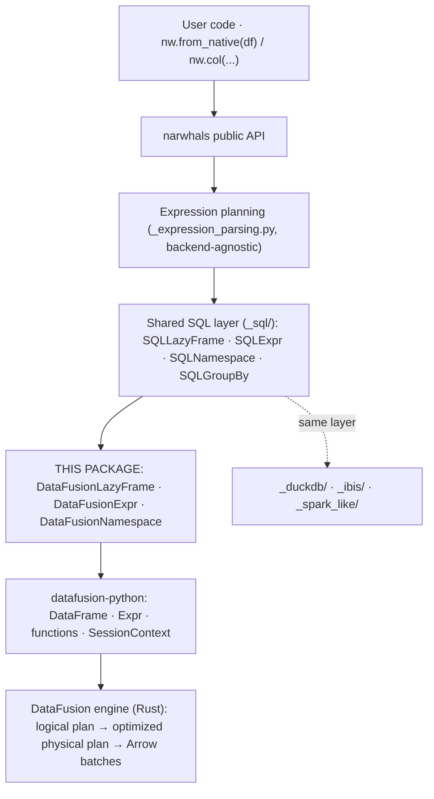

# A DataFusion backend for Narwhals — design specification

> Status: implemented (plugin phase) · addresses [narwhals-dev/narwhals#3225](https://github.com/narwhals-dev/narwhals/issues/3225)
> Original design artifact: <https://claude.ai/code/artifact/1591fb53-60f4-42d6-be62-f01afe745adc>

Wiring Apache DataFusion's lazy, Arrow-native Python DataFrame into Narwhals'
compliant-backend protocol stack — reusing the shared SQL abstraction layer that
already powers DuckDB, Ibis, and Spark, so the new backend is ~15 abstract
methods plus glue rather than a full reimplementation.

## Context — why this pairing works

Narwhals is a zero-dependency compatibility layer exposing a Polars-like API
over many dataframe libraries. DataFusion is Apache Arrow's Rust query engine;
its Python package exposes a **fully lazy** `DataFrame` whose methods build a
logical plan, with an expression API (`col`, `lit`, `datafusion.functions`,
`Expr.over(Window(...))`) that maps almost one-to-one onto what Narwhals'
SQL-style backends already consume.

Three properties make the fit unusually good:

- **Arrow-native types everywhere.** `DataFrame.schema()` returns a
  `pyarrow.Schema` and `Expr.cast()` takes a `pyarrow.DataType`. Narwhals
  already maintains a bidirectional pyarrow ↔ narwhals dtype bridge in
  `_arrow/utils.py` — DataFusion reuses it nearly wholesale.
- **Arrow PyCapsule interop both directions.** `DataFrame.__arrow_c_stream__`
  is implemented, and `SessionContext.from_arrow()` accepts any
  `__arrow_c_stream__`/`__arrow_c_array__` exporter. Zero-copy handoff in and
  out of Narwhals is free.
- **A shared abstraction already exists.** Narwhals' `_sql/` layer
  (`SQLLazyFrame` / `SQLExpr` / `SQLNamespace` / `SQLGroupBy`) factors the hard
  parts — window pushdown, expression metadata threading, when/then, horizontal
  ops, ~85 expression methods — behind a handful of abstract primitives.
  DuckDB, Ibis, and Spark all sit on it; DataFusion slots in beside them.

Demand is established: narwhals#3225 "Support datafusion-python" is open with
no implementation, and no Narwhals-related work exists in
`apache/datafusion-python`. This design is greenfield.

## Decision — plugin-first, in-tree ready

Narwhals documents two ways to add a backend; `docs/extending.md` warns the bar
for in-tree libraries is "very high". Both paths implement the *same* compliant
classes; only registration differs.

**Chosen: out-of-tree plugin (`narwhals-datafusion`)** — recommended starting point:

- Entry point in group `narwhals.plugins`; zero changes to narwhals itself
  (mechanism merged in narwhals#2978, template at `packages/test-plugin/`,
  precedent: `narwhals-daft`).
- Runs narwhals' own test suite via `pytest --use-external-constructor`.
- Ships immediately; decouples from maintainer acceptance and from DataFusion's
  fast release cadence.

**Goal state: in-tree backend (`Implementation.DATAFUSION`)** — pending
maintainer buy-in: new `src/narwhals/_datafusion/` package plus ~16
registration touch points, first-class typing overloads, docs completeness
tables, CI matrix entry. Requires prior discussion on #3225.

Concretely: build the compliant classes with in-tree conventions (naming, file
layout, `not_implemented()` descriptors) so the code is copy-in ready, ship it
first as a plugin, and open the in-tree discussion on #3225 with the working
plugin as evidence.

## Narwhals API version — v2 (main), v1-ready

The backend targets the **main v2 API** (narwhals 2.x, pinned `>=2.25,<3`).
It does not hard-code v2 semantics anywhere: like all compliant backends, every
class is parameterized by the `Version` object narwhals passes in
(`DataFusionExpr._version`, `DataFusionLazyFrame._version`, dtype conversion via
`narwhals_to_native_dtype(dtype, version)`), the same mechanism narwhals uses to
serve both `Version.MAIN` and `Version.V1` from one implementation.

In practice only the main API reaches the plugin today: `narwhals.stable.v1`
does not resolve out-of-tree plugin backends (a narwhals-core gap, alongside
`nw.scan_csv(backend=module)` and `.lazy(backend=...)`) — the source of the
"v1 stable API" failures in the backlog. Once narwhals routes `stable.v1`
through the plugin system, v1 support should come for free via the existing
`Version` plumbing, with no changes needed in this package.

## Architecture

Narwhals plans expressions itself (`_expression_parsing.py`) and evaluates the
plan against a compliant namespace. The DataFusion backend only translates
evaluated nodes into native `datafusion.Expr` objects and frame verbs into
`datafusion.DataFrame` method calls — the engine does the rest.

### Package layout

| File | Contents | Modeled on |
| --- | --- | --- |
| `dataframe.py` | `DataFusionLazyFrame(SQLLazyFrame, ValidateBackendVersion)` wrapping `datafusion.DataFrame`; cached schema/columns | `_duckdb/dataframe.py` |
| `expr.py` | `DataFusionExpr(SQLExpr[...])` — the six SQL hooks + backend-specific methods | `_ibis/expr.py` (pure expression API, no SQL strings) |
| `namespace.py` | `DataFusionNamespace(SQLNamespace[...])` — 4 primitives + IO/constructor surface | `_duckdb/namespace.py` |
| `group_by.py` | `DataFusionGroupBy(SQLGroupBy)` — `__init__` + `agg` | `_duckdb/group_by.py` |
| `selectors.py` | `DataFusionSelectorNamespace` + `DataFusionSelector._to_expr` | `_duckdb/selectors.py` |
| `expr_str.py` / `expr_dt.py` / `expr_list.py` / `expr_struct.py` | Accessor namespaces; str/dt inherit most from `_sql/` defaults | same files in `_duckdb/` |
| `utils.py` | Thin dtype bridge delegating to `_arrow/utils.py`; `FUNCTION_REMAP`; sort-expr builders; error translation; default `SessionContext` | `_duckdb/utils.py` (much smaller here) |

## Core contracts

### Namespace — four SQL primitives

Implementing these on `DataFusionNamespace` unlocks the shared layer's
`when_then`, `coalesce`, and all horizontal functions for free:

- `_function(name, *args)` — remap the few names that differ
  (e.g. `char_length` → `character_length`, `dayofyear` → `date_part('doy', ·)`)
  then `getattr(datafusion.functions, name)(*args)`.
- `_lit(value)` — `lit(value)`; pyarrow scalars accepted natively.
- `_when(condition, value, otherwise)` — `f.when(...).otherwise(...)` / `.end()`.
- `_coalesce(*exprs)` — `f.coalesce(*exprs)`.

### Expr — six SQL hooks

The entire price of admission to `SQLExpr`'s ~85 free methods:

| Abstract hook | DataFusion translation |
| --- | --- |
| `_count_star()` | `f.count_star()` |
| `_first(expr, *order_by)` | `f.first_value(expr, order_by=[col(c).sort(...)])` |
| `_last(expr, *order_by)` | `f.last_value(expr, order_by=…)` |
| `_any_value(expr, ignore_nulls)` | `f.first_value(expr).null_treatment(NullTreatment.IGNORE_NULLS)` when requested |
| `_window_expression(...)` | `expr.over(Window(partition_by=…, order_by=[SortExpr(...)], window_frame=WindowFrame("rows", start, end)))` — explicit `nulls_first`/`nulls_last` matches narwhals semantics |
| `_alias_native(expr, name)` | `expr.alias(name)` |

Backend-specific additions (following DuckDB's list): `cast` →
`expr.cast(pa_type)`, `is_nan`/`is_finite` → `f.isnan`-family, `is_in`,
`fill_null` → `expr.fill_null(v)`, `null_count` → `_count_star() - f.count(expr)`,
`len` → `f.count_star()`.

### LazyFrame — one abstract method plus the frame verbs

`SQLLazyFrame` requires only `_filter(predicate)`; the shared layer supplies
the non-elementwise-predicate temp-column dance. Frame verbs:

| Narwhals verb | DataFusion call | Notes |
| --- | --- | --- |
| `select` / `with_columns` | `df.select(*e)` / `df.with_columns(*e)` | polars-style `with_columns` exists natively |
| `sort` | `df.sort(*SortExpr)` | per-key `ascending` + `nulls_first` |
| `group_by(...).agg` | `df.aggregate(keys, aggs)` | filtered aggregates via `.filter(...)` builder |
| `unique` | `df.distinct()` | subset form via `row_number()` window + filter |
| `drop_nulls` / `head` / `rename` / `drop` | `filter(is_not_null…)` / `limit` / `with_column_renamed` / `drop` | |
| `explode` | `df.unnest_columns(col)` | single list column, like DuckDB |
| `concat(how="vertical"/"diagonal")` | `df.union(other)` | diagonal via pre-projection of missing columns as typed nulls |
| `with_row_index(order_by=…)` | `f.row_number().over(Window(order_by=…)) − 1` | `order_by` required (matches DuckDB policy) |
| `collect(backend)` | `to_arrow_table()` / `to_pandas()` / `to_polars()` | all three native; pyarrow default |
| `unpivot` | union-of-selects (k projections + `union`) | no native unpivot |
| `sink_parquet` | `df.write_parquet(path)` | |

## The five design problems and their resolutions

1. **Join semantics — no suffix parameter.** DataFusion's `join()` has no
   `suffix` argument. Resolution: pre-rename colliding right-side columns
   before joining (collision set = right ∩ left minus coalesced keys), join
   with `left_on`/`right_on`, drop duplicate right keys — mirrors
   `_spark_like`. Cross joins via `join_on(right, lit(True), how="inner")`.
   `join_asof`: no ASOF support → `not_implemented()`, same as Spark.
2. **Row order — none guaranteed.** DataFusion is a parallel SQL engine; row
   order is undefined except after `sort`. This is exactly the contract
   Narwhals' lazy backends already live under. All order-dependent operations
   flow through `SQLExpr`'s window machinery with explicit `order_by`.
   Classified *lazy-only, order-agnostic*, beside DuckDB.
3. **SessionContext ownership.** A `datafusion.DataFrame` carries its context.
   A module-level default `SessionContext` (precedent: `narwhals/sql.py`'s
   DuckDB `CONN`) is used only for `scan_csv`/`scan_parquet` and
   `.lazy(backend="datafusion")` conversions; user-supplied frames keep their
   own contexts. Cross-context joins were a spike question; if unsupported,
   raise a clear `InvalidOperationError`.
4. **Dtype bridge — delegate to the Arrow one.** `utils.py` delegates to
   `narwhals._arrow.utils` both directions, plus an `UNSUPPORTED_DTYPES` guard
   for engine-side gaps (candidates: `Float16`, dictionary/`Categorical`,
   `Enum`). No `DeferredTimeZone` analogue needed — timezones live in the
   Arrow type itself.
5. **Error translation.** A `catch_datafusion_exception(exc, frame)` wrapper
   (modeled on `catch_duckdb_exception`) pattern-matches planner errors like
   `Schema error: No field named …` into typed narwhals exceptions
   (`ColumnNotFoundError.from_available_column_names(...)`) around
   `select` / `with_columns` / `aggregate` / `_filter`.

## Feature coverage at launch

Baseline: DuckDB, the most complete lazy backend.

| Area | Status | Detail |
| --- | --- | --- |
| Arithmetic/comparison/boolean ops; ~50 aggregations; `cum_*`, `rolling_*`, `rank`, `diff`, `shift`, `over` | free | from `SQLExpr` via the six hooks |
| `when/then/otherwise`, horizontal fns, `coalesce` | free | from `SQLNamespace` via the four primitives |
| `.str` / `.dt` accessor cores | free | `_sql/` defaults + `FUNCTION_REMAP` entries |
| Frame verbs, joins, group_by, selectors, `collect`, `scan_csv`/`scan_parquet`, `sink_parquet` | custom | per the mapping tables above |
| `.list` / `.struct` accessors | custom | `array_*` functions and struct field access; scoped to DuckDB's method list |
| `join_asof`, `ewm_mean`, `map_batches`, `.cat`, `str.replace(n=1)`, exact `quantile` | deferred | no engine support or excluded at the `LazyExpr` layer |
| `mode`, `skew`, `kurtosis` | optional | via the `extra-functions-ffi` wheel (see `extra-functions-ffi/` and README); `not_implemented()` without it |
| Eager `DataFrame`/`Series` | deferred | lazy-only backend, like DuckDB/Ibis |

## Testing and CI

- **Plugin phase (current):** run narwhals' own suite via
  `pytest tests/ --use-external-constructor -p narwhals_datafusion.testing`,
  plus this repo's own tests (`pytest tests/`).
- **Constructor (in-tree):** `datafusion_lazy_constructor` in
  `tests/conftest.py` — `SessionContext().from_arrow(pa.table(obj))` —
  registered in `LAZY_CONSTRUCTORS["datafusion"]`.
- **Materialization branch:** extend `tests/utils.py::assert_equal_data` with a
  DataFusion arm (`result.to_native().to_arrow_table()`).
- **Dedicated workflow (in-tree):** `pytest-datafusion.yml`, path-triggered,
  `--constructors=datafusion` with `--cov-fail-under=95` — the Ibis/PySpark
  template, keeping DataFusion's release cadence out of the core coverage job.

## Phased delivery

1. **Spike — resolve the open questions.** Plugin skeleton from
   `packages/test-plugin/`; verify cross-context joins, `ExprFuncBuilder`
   finalization inside `aggregate`, cross-join workaround, minimum supported
   version (proposed ≥ 49), rejected pyarrow types (→ `UNSUPPORTED_DTYPES`),
   function-name deltas (→ `FUNCTION_REMAP`). *~2–3 days.* ✅ done
2. **Core backend.** Dtype bridge, error translation, `DataFusionLazyFrame`
   verbs, six `SQLExpr` hooks, four `SQLNamespace` primitives, `GroupBy`,
   selectors. *~1–2 weeks.* ✅ done
3. **Accessor namespaces & joins.** `.str`/`.dt`/`.list`/`.struct`; join
   suffix machinery; `unpivot` via union-of-selects; `with_row_index`;
   `concat` variants. *~1 week.* ✅ done
4. **Ship the plugin, open the in-tree conversation.** Publish
   `narwhals-datafusion` with CI running narwhals' suite via
   `--use-external-constructor`. Post the design + working plugin on
   narwhals#3225 and ask maintainers about in-tree adoption. *~2 days +
   review latency.* ⏳ pending
5. **In-tree migration (on acceptance).** Copy classes into
   `src/narwhals/_datafusion/`; execute the 16-point registration checklist;
   `pytest-datafusion.yml`; coverage config; completeness-generator entry
   (`Backend("datafusion", LAZY)`); docs; typing suite green under
   mypy + pyright. *~1 week, mostly mechanical.* ⏳ pending

## Risks and mitigations

| Risk | Severity | Mitigation |
| --- | --- | --- |
| DataFusion's major-version cadence (~monthly) breaks the backend | Medium | Own path-triggered CI job (never blocks core); `requires.backend_version` gating; plugin phase absorbs the churn before in-tree commitment |
| Narwhals maintainers decline in-tree adoption ("very high bar") | Medium | Plugin is a complete, supported end state — Daft ships this way today; design keeps both paths identical above the registration layer |
| Cross-context frame operations fail | Low | Fallback: route through `__arrow_c_stream__` re-registration into a shared context, or raise a typed error |
| Semantic drift in null ordering / NaN handling vs Polars | Low | Narwhals' suite is opinionated about exactly this; `SortExpr(nulls_first=…)` gives explicit control; divergences become skips with linked issues |
